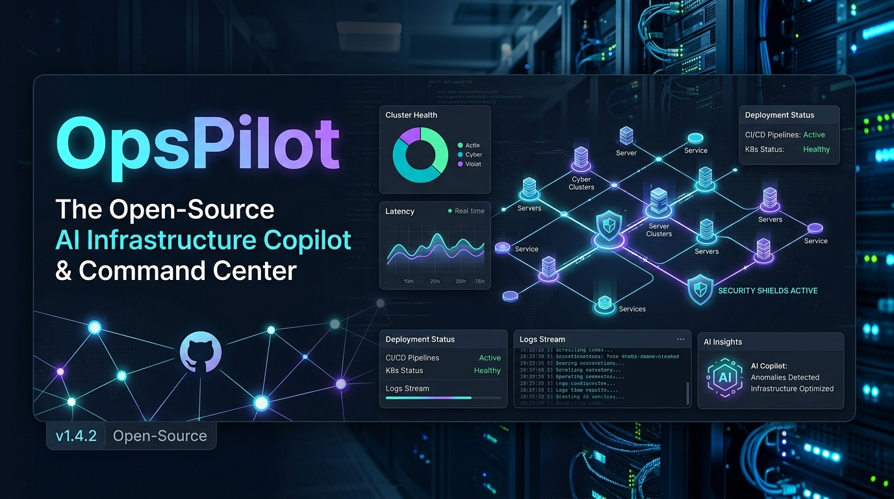

<p align="center">
  
</p>

<h1 align="center">OpsPilot 🚀</h1>

<p align="center">
  <b>Your servers, in your pocket.</b><br>
  A self-hosted infrastructure copilot that watches your Docker stack, tracks your renewals,<br>
  and lets you fix things straight from <b>Telegram</b> — no dashboard, no SaaS, no shell access.
</p>

<p align="center">
  <a href="LICENSE"></a>
  <a href="https://www.python.org/downloads/"></a>
  <a href="https://telegram.org/"></a>
  <a href="https://www.docker.com/"></a>
  <a href="CHANGELOG.md"></a>
  <a href="CONTRIBUTING.md"></a>
</p>

---

## Why OpsPilot?

You run a few servers. Something crashes at 2 a.m. A domain quietly expires. A VPS bill goes overdue.
Full observability stacks are overkill, and most uptime tools don't let you *do* anything about it.

OpsPilot is one small container that:

- 👀 **Watches** containers, disk, SSL certificates and HTTP endpoints
- 🔔 **Alerts** you in Telegram, once, with buttons to act right there
- 🛠️ **Fixes** things: tail logs, restart a service, snooze the noise
- 💳 **Remembers** what you pay for and nags you until it's paid
- 🤖 **Explains** what's wrong using the LLM of your choice (optional)

Configure it **from the chat itself**. Add a probe or a renewal in 30 seconds, no redeploy.

---

## ✨ Features

| | |
|---|---|
| **🔭 Observe** | CPU, RAM, disk, load, Docker container health, SSL expiry, HTTP endpoint uptime and latency. |
| **🚨 Incidents** | Failures become incidents: deduplicated (no alert storms), auto-resolved with a recovery message, snoozable, pruned after 30 days. |
| **🌐 HTTP probes** | Add and remove endpoints at runtime with `/addprobe`. Expected status code, timeouts, instant status with `/probes`. |
| **💳 Renewals** | Track VPS, domains, SSL and software bills. Reminders repeat daily until you tap **Mark Paid**; monthly and yearly items roll forward automatically. |
| **🔇 Smart snooze** | Snooze a container or incident for 1h / 24h / 7d / forever, straight from the alert button. |
| **⚡ ChatOps** | Interactive Telegram menu and inline buttons: logs, restart with confirmation, ignore, resolve, mark paid. |
| **🤖 AI Copilot** | `/ask why is the API slow?` with OpenAI, Anthropic Claude, Google Gemini or local Ollama (optional). |
| **🛡️ Zero-shell security** | No `shell=True`, ever. Every action goes **Allowlist → Safe Executor → Audit Trail**. |
| **🧹 Automation** | Opt-in Docker cache pruning when disk usage crosses your threshold. |
| **🔌 Pluggable channels** | Alerts go through a small `NotificationChannel` interface. Telegram ships today; add Slack, email or Discord in ~40 lines. |

---

## 🚀 Quickstart (Docker, ~5 minutes)

**1. Create a Telegram bot** with [@BotFather](https://t.me/BotFather) and grab the token. Find your numeric user ID with [@userinfobot](https://t.me/userinfobot).

**2. Get the files**

```bash
git clone https://github.com/iitdeveloper-git/opspilot.git
cd opspilot
cp .env.example .env
cp config.example.yaml config.yaml
mkdir -p data audit_logs        # persistent state lives here
```

**3. Configure `.env`**

```env
TELEGRAM_BOT_TOKEN="123456789:ABCdefGHIjklMNOpqrSTUvwxYZ"
TELEGRAM_ALLOWED_USER_IDS="YOUR_TELEGRAM_USER_ID"
TELEGRAM_ALERT_CHAT_ID="YOUR_CHAT_ID"      # can be changed later with /setchat
OPSPILOT_AUTH_MODE=production               # never "development" on a real server
```

> **Fail-closed by default.** If `TELEGRAM_ALLOWED_USER_IDS` is empty, OpsPilot denies everyone.

**4. Start it**

```bash
docker compose up -d
```

Open your bot in Telegram and send `/start`. That's it.

<details>
<summary><b>Run without Docker</b></summary>

```bash
pip install -e ".[ai]"     # or: uv pip install -e ".[ai]"
opspilot status            # one-off CLI checks
opspilot ps
opspilot start             # run the 24/7 daemon
```
</details>

<details>
<summary><b>Production image</b></summary>

```bash
IMAGE_TAG=v0.3.0 docker compose -f docker-compose.prod.yml up -d
```

Images are published to `ghcr.io/iitdeveloper-git/opspilot`.
</details>

---

## 📱 A day with OpsPilot

```text
🚨 Container Alert — node-01
   api-worker is unhealthy
   [📜 Logs] [🔄 Restart] [🔇 Snooze 1h] [🔇 Snooze 24h]

✅ Recovered — api-worker is healthy again

💳 Renewal due in 3 days — OVH VPS Node-01 · ₹1,200
   [✅ Mark Paid] [🔇 Snooze 24h] [🔇 Snooze 7d]
```

Add a monitor without touching a file:

```text
/addprobe     →  name → URL → expected status   ✔ live on the next cycle
/addrenew     →  name → category → due date → amount → recurrence
/setchat -100123456789                            ✔ alerts move immediately
```

---

## 📖 Command reference

| Command | What it does |
|---|---|
| `/start` · `/help` | Welcome menu and full command list. |
| `/status` | Live CPU, memory, disk and load. |
| `/ps` | Docker containers and their health. |
| `/logs <container> [N]` | Tail the last *N* log lines (default 40). |
| `/restart <container>` | Restart, with a confirmation button. |
| `/ignore <name> [1h\|24h\|7d\|forever]` | Mute alerts for a container. |
| `/unignore <name>` · `/ignored` | Resume alerts · list muted containers. |
| `/probes` | Check every HTTP endpoint right now. |
| `/addprobe` · `/rmprobe <id>` | Add (guided) or remove an HTTP endpoint. |
| `/renewals` | Pending and overdue renewals, with action buttons. |
| `/addrenew` | Add a renewal (guided). |
| `/incidents` | Open incidents, paginated. |
| `/setchat <chat_id>` | Change where alerts are delivered, live. |
| `/settings` | Show current runtime settings. |
| `/ask <question>` | AI diagnosis using live telemetry. |

---

## ⚙️ Configuration

OpsPilot has two layers:

1. **`config.yaml`** — static defaults and *seed data* (thresholds, AI provider, initial probes and renewals).
2. **SQLite (`data/opspilot.db`)** — runtime state you manage from Telegram: probes, renewals, incidents, snoozes, alert chat ID.

**How they interact:** items in `http_endpoints` and `monitoring.initial_renewals` are copied into the database on startup (never duplicated). After that, the database is what you edit from Telegram.

```yaml
monitoring:
  interval_seconds: 60
  ssl_domains: ["example.com"]
  http_endpoints:
    - name: "Primary API"
      url: "https://api.example.com/health"
      expected_status: 200
db_path: "data/opspilot.db"
```

See [`config.example.yaml`](config.example.yaml) and [`.env.example`](.env.example) for every option.

### 💾 Persistence and backups

Mount `./data` as a volume (the provided compose files do). **Without it, your renewals, probes and snoozes are lost when the container is replaced.**

Back up by copying `data/opspilot.db` (the database uses WAL mode, so copy the `-wal` and `-shm` files too, or stop the container first).

### ⬆️ Upgrading from v0.2.x

- Add the `./data:/app/data` volume to your compose file.
- Your `audit_logs/ignored_containers.json` is imported into the database once on first start, then renamed to `.json.migrated`.

---

## 🏗️ Architecture

```text
                   ┌──────────────────────────┐
                   │   Telegram (you)         │◄──── alerts + buttons
                   └────────────┬─────────────┘
                                │ commands
                   ┌────────────▼─────────────┐
                   │  ChatOps bot (aiogram)   │  Allowlist ► Executor ► Audit trail
                   └────────────┬─────────────┘
   ┌────────────────────────────┼─────────────────────────────┐
   │                    Background scheduler                  │
   │  health loop │ HTTP probe loop │ renewals (daily) │ maintenance
   └────────────────────────────┬─────────────────────────────┘
                                │
        ┌───────────────┬───────┴────────┬───────────────┐
        ▼               ▼                ▼               ▼
   Docker / system   HTTP + SSL      SQLite store    NotificationChannel
   monitors          probes          (state)         (Telegram, yours next)
```

Single container, no external services, roughly the footprint of a small Python process.

---

## 🔒 Security model

- **Fail-closed auth:** an empty `TELEGRAM_ALLOWED_USER_IDS` denies everyone in production mode. The check covers both messages and button presses.
- **No shell injection:** everything runs through `SafeOperationExecutor`; arbitrary shell strings are never executed.
- **Audit trail:** every executed and blocked action is written to `audit_logs/audit_trail.jsonl`.
- **Docker socket is a trust boundary:** mounting it gives host-level power. Mounted read-only in our compose files, but still treat it as sensitive.
- **Probes make outbound requests:** `/addprobe` lets an allowed user make the server request any URL, including internal addresses. Keep the allowlist small.

Details and how to report a vulnerability: [SECURITY.md](SECURITY.md).

---

## 🗺️ Roadmap

**Shipped:** container health · SSL checks · HTTP probes · incidents · renewals · snooze · AI copilot · runtime config · channel interface

**Next**
- [ ] Additional channels: email, Slack, Discord, generic webhooks
- [ ] Optional web admin UI (`opspilot[web]`) — only if the Telegram workflow proves insufficient
- [ ] `/backup`: on-demand and scheduled database backups
- [ ] Per-user roles (RBAC) beyond the allowlist
- [ ] Root-cause-analysis workflow with AI
- [ ] Tamper-evident, append-only audit storage
- [ ] Multi-server support

Have an idea? [Open an issue](../../issues/new/choose).

---

## 🤝 Contributing

Contributions are very welcome, from typo fixes to whole new channels.

- Read [CONTRIBUTING.md](CONTRIBUTING.md) for setup, tests and the PR checklist.
- Look for issues labelled **good first issue**.
- **Adding a notification channel** is the easiest meaningful contribution: implement `NotificationChannel` in `src/opspilot/channels/` (see the guide in CONTRIBUTING).

If OpsPilot saves you a 2 a.m. wake-up, a ⭐ helps others find it.

---

## 📄 License

Apache License 2.0. See [LICENSE](LICENSE).
Maintained with ❤️ by **[IITDEVELOPER](https://iitdeveloper.com)**.
